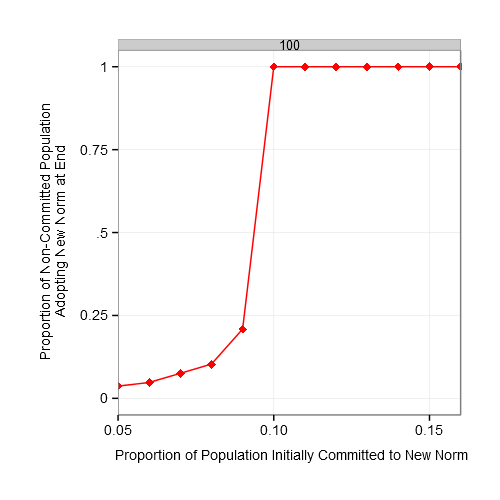

#CommittedMinorities 

Simulator for the social dynamics of committed minorities (based on the paper from [Xie et al., 2011](http://journals.aps.org/pre/abstract/10.1103/PhysRevE.84.011130)).

Answers the question: "In a population where everyone uses norm B, what fraction of the population needs to be committed to a new norm A to sway the majority to adopt this new minority convention?"

Answer: ~10%

With 2 norms, there are 2 fixed points in the system that vary as a function of the proportion of the population that are committed agents. There is a phase transition from a regime where there is virtually no adoption when there is less than ~10% committed agents to a regime where there is universal adoption above this threshold.

The Naming Game is a model of convention formation from [Baronchelli et al](http://iopscience.iop.org/1742-5468/2006/06/P06014 "Naming Game"). It has been used to study the effect of network structure on convention formation. Some important findings are [here](https://sites.google.com/site/andreabaronchelli/naming_game).

The simulations here are based on research from [Xie et al., 2011](http://journals.aps.org/pre/abstract/10.1103/PhysRevE.84.011130).

#To Run
To run these simulations, place the .py files in a directory. Then, from the command line:

````
python StandardNameGame.py <population size> <number of simulations> <file number> <output path>
````

This will output a .csv file with the results.

Then, to plot the results, run:

````
Rscript.exe Plotter.R
````

Alternatively, you can run the example simulation using the shell script from the command line:

````
example_simulation.sh
````

This will produce the figure Results.png. It should look like the following, which shows a critical threshold at ~10%:



# Requirements

-  pandas
-  ggplot2
-  dplyr